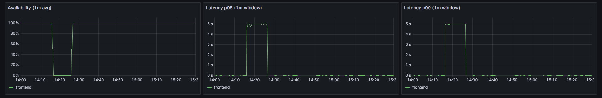
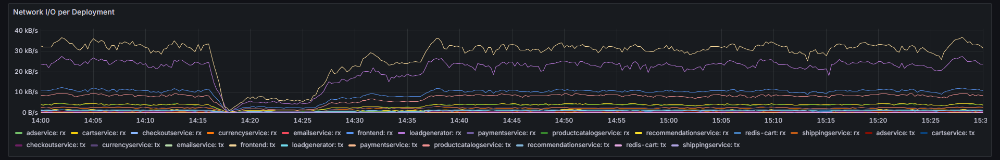
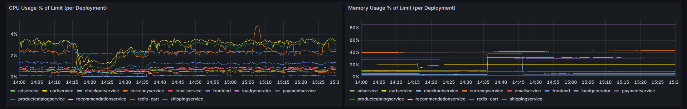

# Evaluation of Kubernetes Software Reliability Using Chaos Engineering Tools

> **Integrated Master's Thesis (2026)** > **Student:** Konstantinos Iatrou (AEM: 58071)  
> **Academic Supervisor:** Professor Vassilis Tsaoussidis  
> **Institution:** Democritus University of Thrace, School of Engineering, Department of Electrical and Computer Engineering, Software and Application Development Sector  
> **Based on:** `IatrouK_2026.pdf`

---

## 🎯 Introduction & Research Objectives

This thesis investigates the reliability and resilience of distributed systems in Cloud Native environments. Specifically, a full lifecycle of the **Chaos Engineering Methodology** is applied to the **Kubernetes** container orchestration platform to uncover vulnerabilities, quantify system degradation, and implement automated resilience enhancements.

Google's **Online Boutique** microservices architecture was deployed as the target application for all fault injection experiments.

### 🔍 Core Research Questions
* **Question 1:** What are the system's operational boundaries under severe network congestion and bandwidth limitations?
* **Question 2:** Are the default Kubernetes self-healing mechanisms sufficient at the Pod level during unexpected failures?
* **Question 3:** How does resource exhaustion (CPU/Memory throttling, OOM events) impact the stability of co-located services (the *Noisy Neighbor* effect)?
* **Question 4:** To what extent can supplementary cloud-native mechanisms—such as Horizontal Pod Autoscaling (HPA) and fine-tuned Liveness/Readiness probes—mitigate degradation and accelerate recovery?

---

## 🛠️ Architecture & Technology Stack

* **Infrastructure:** Distributed Kubernetes Cluster (Virtual Machines).
* **Microservices Application:** Google Cloud Online Boutique (11+ stateless/stateful polyglot microservices).
* **Chaos Engineering Framework:** Chaos Mesh.
* **Observability & Monitoring:** Prometheus (metrics collection) & Grafana (visualization and dashboards).

---

## 📊 Chaos Experiments & Quantitative Results

The research was conducted in two distinct phases: **Initial Execution** (default cluster state) and **Re-execution** (hardened state with advanced resilience configurations).

### 1. Web Frontend Pod Failure (Pod Failure/Kill)
* **Problem:** Terminating the frontend pod dropped overall availability to zero. Although Kubernetes initiated 8.5 restarts on average, the service remained unavailable to users for an extended period due to overly conservative default probe intervals.
* **Mitigation:** Applied precise fine-tuning to the Readiness and Liveness probes to drastically minimize detection and recovery lag.

### 2. Network Experiments (Network Latency & Bandwidth Limitation)
* **Exponential Latency Amplification:** Introducing a mere **80ms** of artificial network latency caused the end-to-end p99 response time of the frontend to spike to **1291.94ms** due to cascading microservice calls. At **300ms** of injection, the p99 latency escalated to **4469.58ms**, causing cascading timeouts (0% availability).
* **Bandwidth Throttling:** Restricting the network bandwidth to 1 Kbps triggered partial cluster collapse, a 15,781% increase in response latency (averaging 2.3 seconds), and an 88.51% drop in throughput due to TCP congestion window exhaustion.

### 3. Resource Stress (CPU & Memory Constraint)
* **Moderate Stress:** Triggered over 2,000 Out-Of-Memory (OOM) events, exposing system-wide weaknesses under high load. CPU utilization surged by 1,242% on the `cartservice` and 4,417% on the `emailservice` (*Noisy Neighbor* phenomenon).
* **Heavy Stress:** Frontend power consumption spiked by 765.6%, inducing a 58.61% CPU throttle rate.

---

## 📈 Before vs. After Resilience Enhancements (Complex Scenarios)

The cluster was hardened by implementing Horizontal Pod Autoscaling (HPA), Pod Disruption Budgets (PDBs), strict Resource Requests/Limits, anti-affinity allocation policies, and optimized Probes.

### Moderate Complex Scenario (Chaos Injection on Advertisement Service)
| Metric | Baseline Experiment (Default) | Hardened Experiment (Optimized) | Delta / System Benefit |
| :--- | :---: | :---: | :---: |
| **Pod Readiness Ratio** | 0% | **50%** | Maintained core functionality (Active replica sustained) |
| **p99 Latency** | 3151.54 ms | **2938.42 ms** | ~6.7% Performance Improvement |
| **Power Consumption (CPU)** | 5.24% | **1.07%** | **79.5% more efficient resource utilization** |

### Aggressive Complex Scenario (High Load & Heavy Latency Injection)
While the default system completely collapsed, the hardened infrastructure experienced controlled degradation but remained fully functional, preserving a minimum of 50% frontend availability and maintaining **100% availability for vital transactional operations** (e.g., the shopping cart).

#### 🖼️ Chart 1: Availability & System Responsiveness

*Note: Visualization corresponding to Figure 75 of the thesis. It demonstrates that availability and request fulfillment times recover immediately to steady-state baselines as soon as the fault injection window closes.*

#### 🖼️ Chart 2: Network Throughput Recovery

*Note: Visualization corresponding to Figure 74 of the thesis. In contrast to the complete throughput flatline seen in the default cluster, the optimized system exhibits only a momentary drop and achieves rapid, total recovery.*

#### 🖼️ Chart 3: Cluster Node Resource Consumption (CPU/Memory)

*Note: Visualization corresponding to Figure 76 of the thesis. Captures the automated load balancing, self-healing, and structural resource stabilization across worker Nodes 5 and 6.*

---

## 📁 Repository Structure

```text
├── manifests/             # Kubernetes YAML files (Deployments, Services, HPA, PDB)
├── chaos-experiments/     # Chaos Mesh Custom Resource Definitions (PodChaos, NetworkChaos, StressChaos)
├── monitoring/            # Prometheus scrape configs & Grafana Dashboard exports
├── scripts/               # Automation, load generation, and benchmarking scripts (Locust)
└── README.md              # Project documentation
```

# 🚀 Usage & Reproduction Guide
### 1. Install Chaos Mesh
Ensure your cluster runs Kubernetes v1.22+ and Helm v3 is configured.

```
helm repo add chaos-mesh [https://charts.chaos-mesh.org](https://charts.chaos-mesh.org)
helm repo update
kubectl create ns chaos-testing
helm install chaos-mesh chaos-mesh/chaos-mesh -n chaos-testing --set dashboard.create=true
```

### 2. Deploy Hardened Target Application
```
# Deploys Online Boutique along with HPA, PDBs, and fine-tuned probes
kubectl apply -f manifests/apps/
```

### 3. Trigger a Chaos Experiment
```
# Injects the optimized network delay scenario explored in the research
kubectl apply -f chaos-experiments/network-delay.yaml
```

# 🔮 Future Directions
This research establishes a foundational framework for cloud-native resilience testing that can be extended into several high-impact domains:

### 1. eBPF Integration (Cilium/Pixie):
Leveraging Extended Berkeley Packet Filters to monitor low-level TCP queue residence times directly within the Linux kernel. This enables deep observability into packet-level congestion during network chaos events, providing microsecond-level accuracy without introducing application or sidecar performance overhead.

### 2. Security Chaos Engineering: 
Expanding the fault injection scope to security boundaries. This includes the runtime execution of automated failure states targeting cluster access controls, such as dynamically stripping RBAC permissions or injecting unauthenticated rogue pods, to evaluate real-time threat containment and defensive alerting thresholds.

### 3. AI/ML for Chaos Automation: 
Introducing machine learning models to analyze multi-dimensional Prometheus metrics streams. This allows the system to dynamically compute a moving baseline for the cluster's steady state and automatically adjust the fault injection blast radius depending on active traffic anomalies.

### 4. Resilience in StatefulSets: 
Deepening validation cycles inside persistent storage layers. Future research will subject managed databases within Kubernetes to volatile stateful disruptions, measuring the exact convergence and consensus recovery rates of protocols like Raft inside etcd under severe multi-node partitions.

# 📄 License
The source code, automation scripts, and deployment manifests in this repository are licensed under the Apache License 2.0.